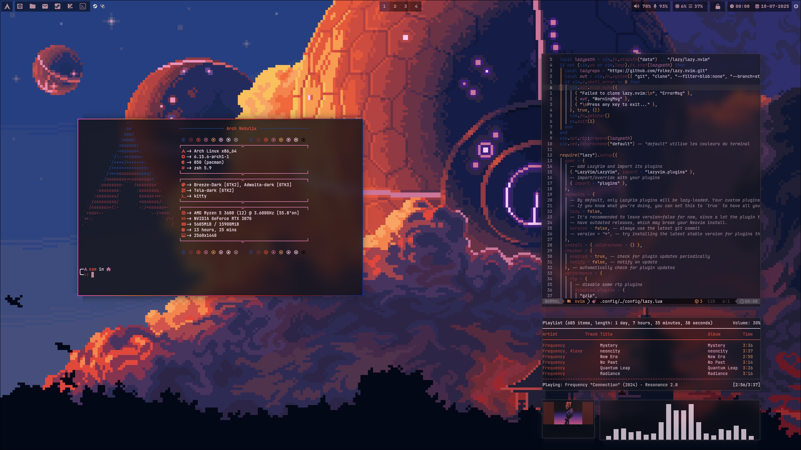
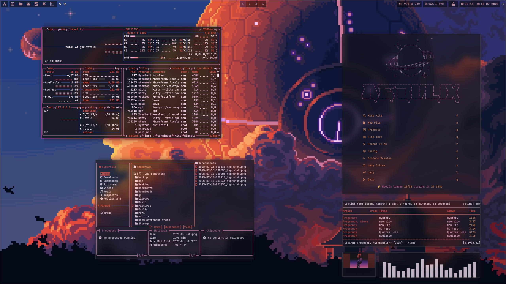
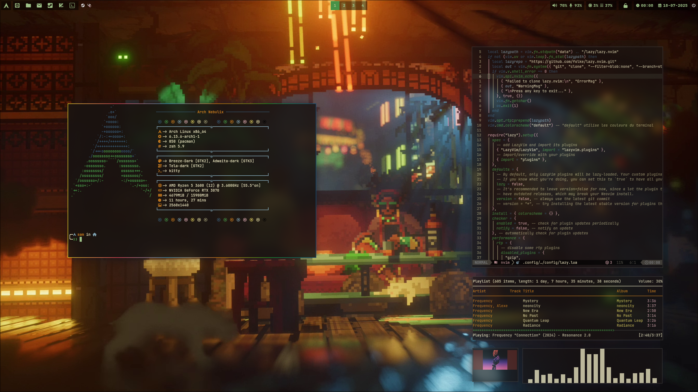
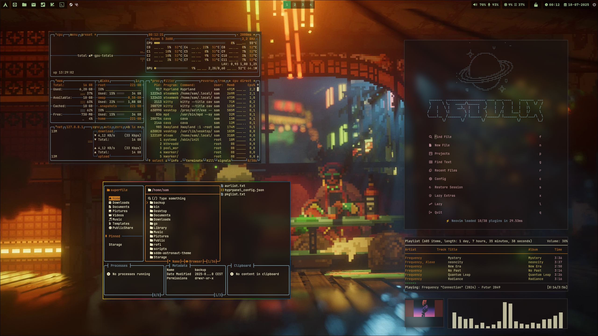
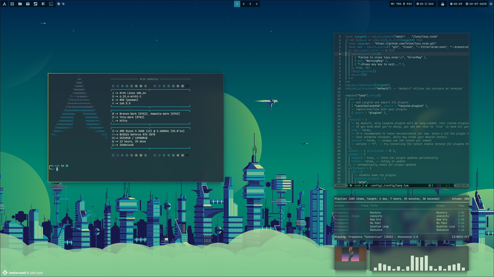
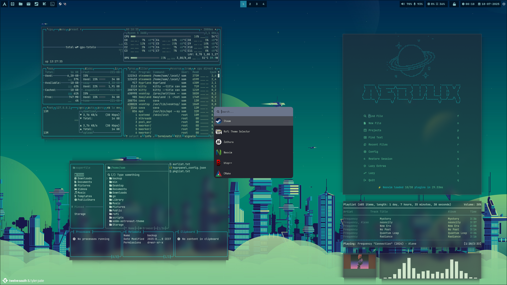
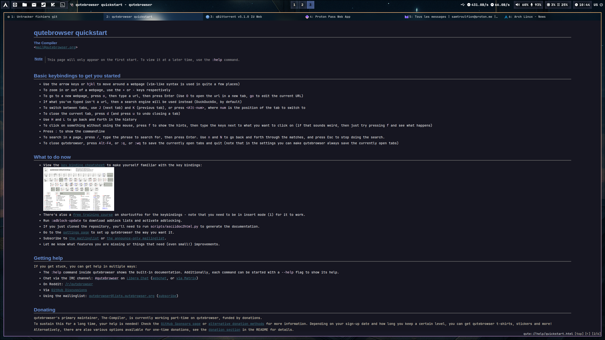
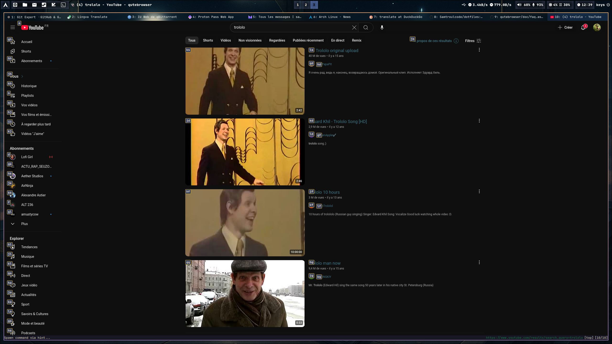
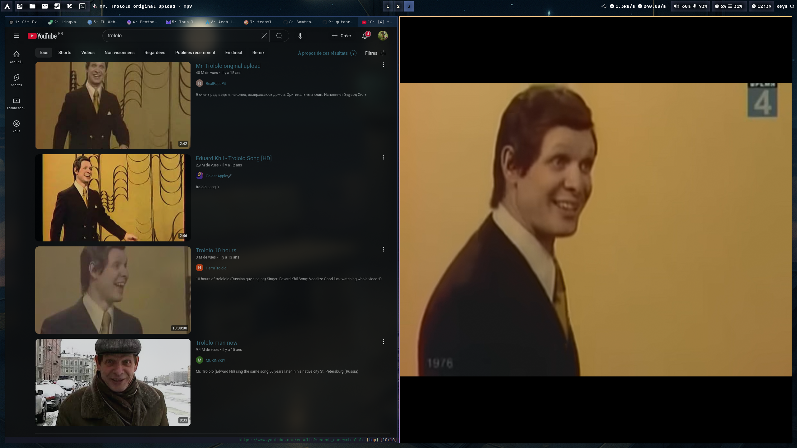

<div align = center>

# Sam's Dotfiles ***NEBULIX*** WIP


My personal Linux dotfiles

I use Arch btw.

|  |  |
| ---- | ---- |
|  |  |
|  |  |
|  |  |


[Showcase video](https://files.catbox.moe/v6n30o.mp4)

</div>

## Note on this repository

I use this repo to sync and backup my dotfiles.

The root of this repo is an equivalent to my $HOME directory

## List of tools used

| Tool | Name/site | repository | config | doc |
| ---- | ---- | ---- | ---- | ---- |
| wayland compositer | [Hyprland](https://hypr.land/) | [github](https://github.com/hyprwm/Hyprland) | [hypr](.config/hypr) | [section](#hyprland) |
| web browser | [Qutebrowser](https://www.qutebrowser.org/) | [github](https://github.com/qutebrowser/qutebrowser) | [qutebrowser](.config/qutebrowser) | [section](#web-browser-qutebrowser) |
| terminal | [Kitty](https://sw.kovidgoyal.net/kitty/) | [github](https://github.com/kovidgoyal/kitty) | [kitty](.config/kitty) | WIP |
| shell | [Oh my zsh](https://ohmyz.sh/) | [github](https://github.com/ohmyzsh/ohmyzsh) | [zsh](.config/zsh)/[zshrc](.zshrc) | WIP |
| shell theming | [Starship](https://starship.rs/) | [github](https://github.com/starship/starship) | [starship](.config/starship.toml) | WIP |
| file explorer | [Superfile](https://superfile.netlify.app/) | [github](https://github.com/yorukot/superfile) | [spf](.config/superfile) | WIP |
| status bar | [Waybar](https://github.com/Alexays/Waybar) | [github](https://github.com/Alexays/Waybar) | [waybar](.config/waybar) | WIP |
| menu | [Rofi](https://davatorium.github.io/rofi/) | [github](https://github.com/davatorium/rofi/) | [rofi](.config/rofi) | WIP |
| notification daemon | [Mako](https://github.com/emersion/mako) | [github](https://github.com/emersion/mako) | [mako](.config/mako) | WIP |
| wallpaper backend | [Swww](https://github.com/LGFae/swww) | [github](https://github.com/LGFae/swww) | [swww](.config/swww) | WIP |
| color generator | [Wallust](https://explosion-mental.codeberg.page/wallust/) | [codeberg](https://codeberg.org/explosion-mental/wallust) | [wallust](.config/wallust) | WIP |
| music player | [Ncmpcpp](https://github.com/ncmpcpp/ncmpcpp) | [github](https://github.com/ncmpcpp/ncmpcpp) | [ncmpcpp](.config/ncmpcpp) | WIP |
| Text editor/IDE | [Nvim](https://neovim.io/) | [github](https://github.com/neovim/neovim) | [nvim](.config/nvim) | WIP |
| Nvim framework | [LazyVim](http://www.lazyvim.org/) | [github](https://github.com/LazyVim/LazyVim) | [lazyvim](.config/nvim) | WIP |

### Window manager *****HYPRLAND*****


Hyprland is a modern, dynamic Wayland compositor featuring both tiling and floating window management, with smooth animations and deep customization. It replaces both the window manager and the compositor, making it ideal for advanced users seeking a minimal and responsive Wayland setup.

### Web Browser *****QUTEBROWSER*****



Qutebrowser is a fancy light browser, extremely customizable and keyboard centered with use of VIM motions. For configuration, it use python scripts, which allows deep customization.

original repo : [Qutebrowser](https://github.com/qutebrowser/qutebrowser)

my configs files : [qutebrowser configs](.config/qutebrowser)

i separated my configuration into several files. The pricipal configuration file with privacy settings, searchengines and global configuration is [here](.config/qutebrowser/config.py) and for my style customization i created a [separated python file](.config/qutebrowser/themes/nebulix.py) that i source in my global customization file : 
```python
config.source('themes/nebulix.py')
```

#### Config tips 

to watch youtubes videos without ads, i know 3 methods actually. You can simply watch the youtube video in mpv by binding a shortcut like that :
```python
config.bind('<Ctrl+/>', 'hint links spawn mpv {hint-url}')
```

you need yt-dlp and mpv to do this 
```bash
sudo pacman -S yt-dlp mpv
```
It will open an MPV player with the YouTube video without the ads, first i hit my shortcut, then i select the video, here is the workflow :

| Step 1 | Step 2 |
|----|----|
|  |  |

The second method is similar to the first but it uses a custom script which allows you to have a single instances of MPV and to add videos in queues, a bit like a playlist.

Script link : [umpv](https://github.com/mpv-player/mpv/blob/master/TOOLS/umpv)

you need to add this script to your $PATH then you simply do this :

```bash
config.bind('<Ctrl+/>', 'hint links spawn umpv --enqueue {hint-url}')
```

The third method use a greasmonkey scripts, but i not cover this solution here, you at least know that it exists.

## Management

I'm using gite bare (git --git-dir=$HOME/.dotfiles/ --work-tree=$HOME) to manage these dotfiles
