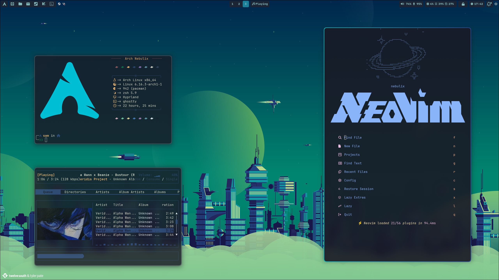
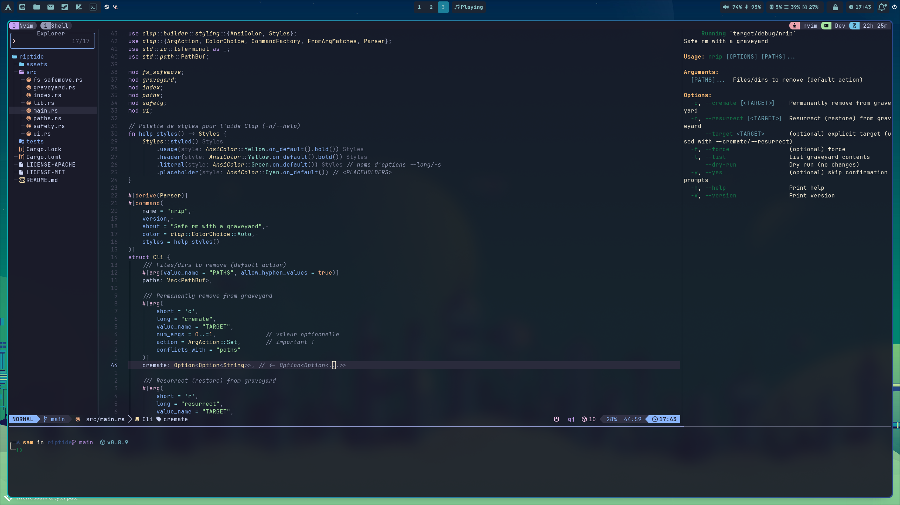

<div align = center>

# Sam's Dotfiles ***NEBULIX*** WIP

My personal Linux dotfiles

I use Arch btw.

|  |  |
| ---- | ---- |
|  |  |

[Showcase video](https://files.catbox.moe/v6n30o.mp4)

## Note on this repository

</div>

I use this repo to sync and backup my dotfiles.

The root of this repo is an equivalent to my $HOME directory

  > [!WARNING]
  > THIS IS NOT A PLUG AND PLAY DOTFILES ! There's no install scripts or step by step guide to install my files, you should know what you do if you want to use it. I only explain how my files are organized, and some tips with some tools. The comments in my files are mainly **IN FRENCH**

<div align = center>

## List of tools used

| Tool | Name/site | repository | config | doc |
| ---- | ---- | ---- | ---- | ---- |
| wayland compositer | [Hyprland](https://hypr.land/) | [github](https://github.com/hyprwm/Hyprland) | [hypr](./nebu-hyprland/.config/hypr) | [section](#hyprland) |
| web browser | [Qutebrowser](https://www.qutebrowser.org/) | [github](https://github.com/qutebrowser/qutebrowser) | [qutebrowser](./nebu-qutebrowser/.config/qutebrowser) | [section](#web-browser-qutebrowser) |
| terminal | [Ghostty](https://ghostty.org/) | [github](https://github.com/ghostty-org/ghostty) | [ghostty](./nebu-ghostty/.config/ghostty/) | WIP |
| shell | [Oh my zsh](https://ohmyz.sh/) | [github](https://github.com/ohmyzsh/ohmyzsh) | [zsh](./nebu-zsh/) | WIP |
| shell theming | [Starship](https://starship.rs/) | [github](https://github.com/starship/starship) | [starship](.config/starship.toml) | WIP |
| file explorer | [Superfile](https://superfile.netlify.app/) | [github](https://github.com/yorukot/superfile) | [spf](./nebu-spf/.config/superfile) | WIP |
| status bar | [Waybar](https://github.com/Alexays/Waybar) | [github](https://github.com/Alexays/Waybar) | [waybar](./nebu-waybar/.config/waybar) | WIP |
| menu | [Wofi](https://hg.sr.ht/~scoopta/wofi) | [sourcehut](https://hg.sr.ht/~scoopta/wofi) | [wofi](./nebu-wofi/.config/wofi) | WIP |
| power menu | [Wlogout](https://github.com/ArtsyMacaw/wlogout) | [github](https://github.com/ArtsyMacaw/wlogout) | [wlogout](./nebu-wlogout/.config/wlogout) | WIP |
| notification daemon | [Swaync](https://github.com/ErikReider/SwayNotificationCenter) | [github](https://github.com/ErikReider/SwayNotificationCenter) | [swaync](./nebu-swaync/.config/swaync) | WIP |
| wallpaper backend | [Swww](https://github.com/LGFae/swww) | [github](https://github.com/LGFae/swww) | [swww](./nebu-swww/.config/swww) | WIP |
| color generator | [Wallust](https://explosion-mental.codeberg.page/wallust/) | [codeberg](https://codeberg.org/explosion-mental/wallust) | [wallust](./nebu-wallust/.config/wallust) | WIP |
| music daemon | [Mpd](https://www.musicpd.org/) | [github](https://github.com/MusicPlayerDaemon/MPD) | [mpd](./nebu-mdp/.config/mpd) | WIP |
| music player | [Rmpc](https://mierak.github.io/rmpc/) | [github](https://github.com/mierak/rmpc) | [ncmpcpp](./nebu-music/.config/rmpc) | WIP |
| video player | [Mpv](https://mpv.io/) | [github](https://github.com/mpv-player/mpv) | [mpv](./nebu-mpv/.config/mpv) | WIP |
| Text editor/IDE | [Nvim](https://neovim.io/) | [github](https://github.com/neovim/neovim) | [nvim](./nebu-nvim/.config/nvim) | WIP |

### Window manager *****HYPRLAND*****


</div>

Hyprland is a modern, dynamic Wayland compositor featuring both tiling and floating window management, with smooth animations and deep customization. It replaces both the window manager and the compositor, making it ideal for advanced users seeking a minimal and responsive Wayland setup.

I separated my configuration into several files :

- [hyprland](./nebu-hyprland/.config/hypr/hyprland.conf) : contains monitor informations, some general settings, and other configuration files imports
- [env](./nebu-hyprland/.config/hypr/config/env.conf) : contains environment variables such as nvidia required variables, hyprcursor theme or keyboard layout
- [start](./nebu-hyprland/.config/hypr/config/start.conf) : contains exec-once entries such as notification daemon or launch scripts
- [var](./nebu-hyprland/.config/hypr/config/var.conf) : contains hyprland variables such as my terminal or file manager.
- [key](./nebu-hyprland/.config/hypr/config/key.conf) : my keybindings
- [colors](./nebu-hyprland/.config/hypr/config/colors.conf) : my color configuration linked with wallust, since is dynamicly generated when i change my wallpapers, i didn't push it to my git. (see [wallust] section)
- [window](./nebu-hyprland/.config/hypr/config/window.conf) : some window rules for apps (like spf floating instead of tilling)
- [theme](./nebu-hyprland/.config/hypr/config/theme.conf) : general theming such as blur or inactive timeout for the cursor.
- [anim](./nebu-hyprland/.config/hypr/config/anim) : it's a folder containing some amimations files, i choose one of those in my import list in [hyprland.conf](.config/hypr/hyprland.conf)
- [plugin](./nebu-hyprland/.config/hypr/config/plug.conf) : contains list of hyprland plugin. Actually, i only use one plugin, [HyprExpo](https://github.com/hyprwm/hyprland-plugins/tree/main/hyprexpo).

#### Config tips

> [!WARNING]
> To add hyprland plugins, you must have hyprland-git installed cause you need the headers exposed by hyprpm to add some plugins.

<div align = center>

### Web Browser *****QUTEBROWSER*****


</div>

Qutebrowser is a fancy light browser, extremely customizable and keyboard centered with use of VIM motions. For configuration, it use python scripts, which allows deep customization.

original repo : [Qutebrowser](https://github.com/qutebrowser/qutebrowser)

my configs files : [qutebrowser configs](./nebu-qutebrowser/.config/qutebrowser)

i separated my configuration into several files. The pricipal configuration file with privacy settings, searchengines and global configuration is [here](./nebu-qutebrowser/.config/qutebrowser/config.py) and for my style customization i created a [separated python file](./nebu-qutebrowser/.config/qutebrowser/themes/nebulix.py) that i source in my global customization file :

```python
config.source('themes/nebulix.py')
```

#### Config tips

to watch youtubes videos without ads, i know 3 methods actually. You can simply watch the youtube video in mpv by binding a shortcut like that :

```python
config.bind('<Ctrl+/>', 'hint links spawn mpv {hint-url}')
```

you need yt-dlp and mpv to do this

```bash
sudo pacman -S yt-dlp mpv
```

It will open an MPV player with the YouTube video without the ads, first i hit my shortcut, then i select the video, here is the workflow :

| Step 1 | Step 2 |
|----|----|
|  |  |

The second method is similar to the first but it uses a custom script which allows you to have a single instances of MPV and to add videos in queues, a bit like a playlist.

Script link : [umpv](https://github.com/mpv-player/mpv/blob/master/TOOLS/umpv)

you need to add this script to your $PATH then you simply do this :

```bash
config.bind('<Ctrl+/>', 'hint links spawn umpv --enqueue {hint-url}')
```

The third method use a greasmonkey scripts, but i not cover this solution here, you at least know that it exists.

## Management

I'm using [gnu stow](https://www.gnu.org/software/stow/) to manage these dotfiles
