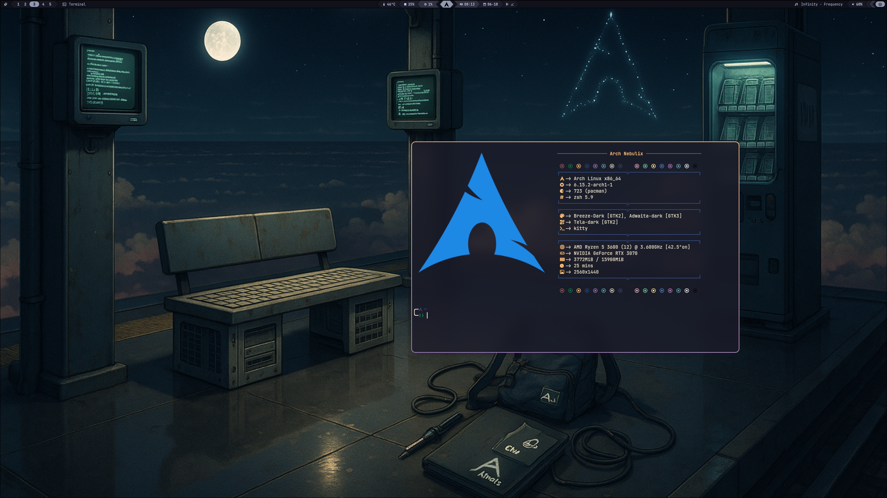

# Sam's Dotfiles ***NEBULIX***

My personal Linux dotfiles

I use Arch btw.

## Note on this repository

I use this repo to sync and backup my dotfiles.

The root of this repo is an equivalent to my $HOME directory

## Management

I'm using gite bare (git --git-dir=$HOME/.dotfiles/ --work-tree=$HOME) to manage these dotfiles
